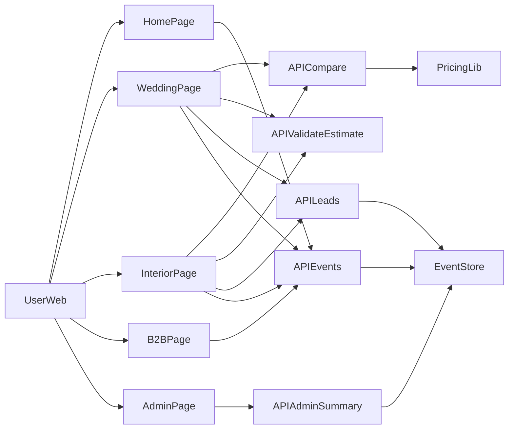

# System Map

프로젝트 전체 구조와 데이터 흐름을 빠르게 파악하기 위한 문서다.

## 런타임 아키텍처

## 데이터 흐름

- 비교
  - 사용자 조건 입력
  - `compare` API 호출
  - `pricing` 로직에서 평균/범위/항목 계산 후 반환
- 견적 검증
  - 텍스트 또는 이미지 업로드
  - 이미지일 경우 OCR 후 텍스트화
  - `validate-estimate` API에서 누락/주의/과다 경고 계산
- 문의
  - `leads` API로 문의 등록
  - 문의 저장 후 `lead_submitted` 이벤트 자동 기록
- 운영 지표
  - `events` API로 수집된 이벤트를 `admin-summary`에서 집계

## 코드 위치 빠른 참조

- 화면: `app/*/page.tsx`
- API: `app/api/*/route.ts`
- 도메인: `lib/*.ts`
- 파이프라인: `pipeline/*.py`
- 샘플 데이터: `data/mock-data.ts`
- 정책/기획 문서: `docs/*.md`
